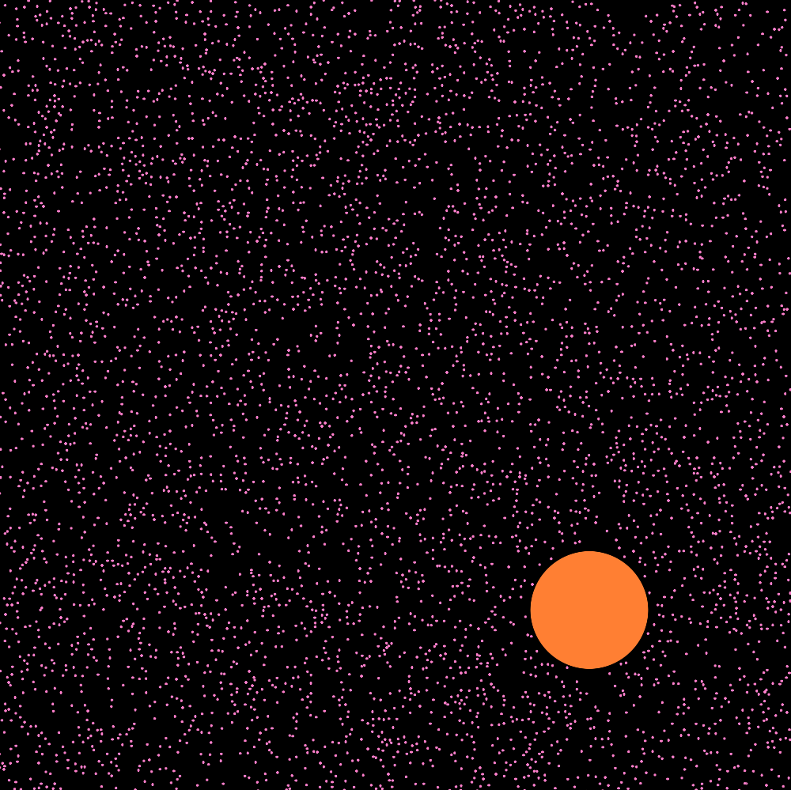

# TorusParticles

A simple C++ program for simulating particle collisions on a torus.



## Build instructions

Requirements:
- [CMake](https://cmake.org/)
- [GLFW](https://www.glfw.org/)
- [Glad](https://github.com/Dav1dde/glad)
- [jsoncpp](https://github.com/open-source-parsers/jsoncpp)

Any of the latter three dependencies not found by CMake will be cloned and built automatically when CMake is run. Note they may require extra dependencies in order to build correctly, see e.g. [GLFW Dependencies](https://www.glfw.org/docs/3.3/compile.html#compile_deps).

Steps:
1. Clone the git repository
```bash
git clone https://github.com/michaelhallam123/TorusParticles.git
cd TorusParticles
```
2. Make a build directory
```bash
mkdir build
cd build
```
3. Build the project with cmake

On Windows:
```bash
cmake ..
cmake --build . --config Release
```
On Linux:
```bash
cmake ..
cmake --build .
```

The executable is located in `build/bin` (`build/bin/Release` on Windows), along with several example preset files. 

When building the code with Visual Studio instead, the shaders folder and preset files must be moved to the same directory as the solution file, and TorusParticles must be set as the startup project.

## Usage

To load a preset, drag and drop it onto the executable file. When run without a preset, the executable will load `preset1.json` by default.

Numbers, sizes, colors, masses and radii of particles, as well as simulation parameters such as the timestep, can be specified in `.json` preset files. See the files in the `presets` folder for examples.

